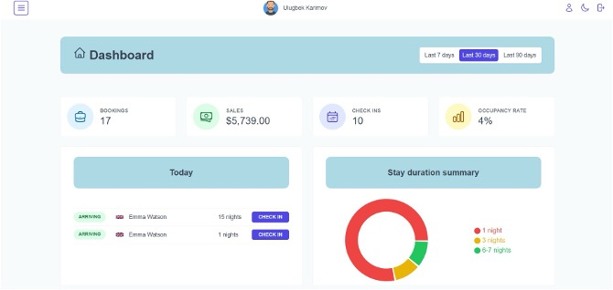
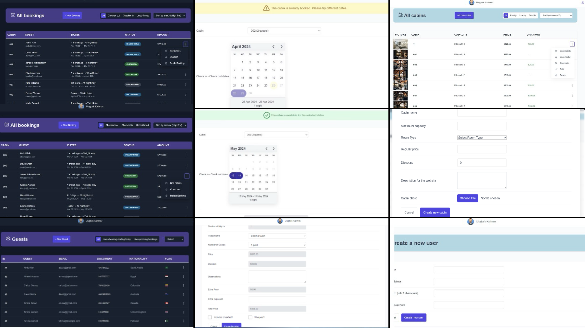

<p align="center">
  
</p>
<h1 align="center">Hotel Management Dashboard</h1>
<p align="center">
  
  
  
  
</p>
<p align="center">
  A comprehensive hotel management system that empowers hotel staff to 
  <b>efficiently manage bookings, rooms, guests, and finances</b> through an intuitive administrative dashboard.
</p>

---

## 📸 Dashboard Overview

<p align="center">
  
</p>

<p align="center">
  
</p>

*Real-time analytics, booking statistics, and comprehensive hotel performance metrics*

---

## 📖 About

The **Hotel Management Dashboard** is a powerful administrative interface designed to streamline hotel operations and replace manual, inefficient booking management processes. Developed as part of a Bachelor's thesis at the University of Central Asia, this system addresses critical challenges faced by hotels in Kyrgyzstan's growing hospitality sector.

**The Challenge:** Traditional hotel management relies on fragmented systems - staff juggle phone reservations, manual room tracking, third-party booking platforms (with high commission fees), and separate payment management systems. This creates data inconsistencies, overbooking risks, and operational inefficiencies.

**The Solution:** An integrated management platform that centralizes all hotel operations in one secure, real-time dashboard, eliminating third-party dependencies and reducing operational costs.

## ✨ Core Features

### 📊 Dashboard & Analytics
- **Real-time KPI Tracking** - Monitor occupancy rates, revenue, and booking trends
- **Visual Analytics** - Interactive charts showing sales, check-ins, and duration statistics
- **Performance Metrics** - Track hotel performance with actionable insights
- **Financial Overview** - Complete revenue tracking and financial reporting

### 🏨 Booking Management
- **Centralized Booking View** - See all reservations in one place
- **Real-time Updates** - Instant synchronization across all booking channels
- **Status Management** - Track checked-in, checked-out, and unconfirmed bookings
- **Booking Modifications** - Easy editing and cancellation handling
- **Payment Tracking** - Monitor payment status and outstanding balances
- **Check-in/Check-out Processing** - Streamlined guest arrival and departure workflows

### 🛏️ Room & Cabin Management
- **Inventory Control** - Manage all rooms with real-time availability status
- **Room Configuration** - Set capacity, pricing, amenities, and descriptions
- **Visual Room Status** - Quick overview of occupied, available, and maintenance rooms
- **Dynamic Pricing** - Adjust rates by season, demand, or special offers
- **Room Assignment** - Intelligent room allocation for bookings

### 👥 Guest Management
- **Guest Profiles** - Comprehensive database of all guests
- **Booking History** - View complete stay history for each guest
- **Contact Information** - Easy access to guest details for communication
- **Guest Preferences** - Track special requests and preferences
- **Document Management** - Store ID verification and important documents

### 👨‍💼 User & Staff Management
- **Role-Based Access Control** - Assign permissions based on staff roles
- **User Authentication** - Secure login and password management
- **Staff Accounts** - Create and manage accounts for receptionists, managers, etc.
- **Activity Logs** - Track user actions for accountability
- **Profile Management** - Update personal information and credentials

### 💰 Financial Management
- **Revenue Tracking** - Monitor daily, weekly, and monthly income
- **Payment Processing** - Record online and offline payments
- **Outstanding Payments** - Track unpaid or partially paid bookings
- **Financial Reports** - Generate detailed financial summaries
- **Expense Tracking** - Log operational costs and expenses

### ⚙️ System Settings
- **Hotel Configuration** - Manage hotel details, contact info, and policies
- **Check-in/Check-out Times** - Set standard operating hours
- **Multi-language Settings** - Configure English and Russian interfaces
- **Notification Preferences** - Customize alerts and reminders
- **System Customization** - Adjust dashboard layout and preferences

## 🛠️ Technology Stack

### Frontend
- **React 18+** - Component-based architecture for maintainable code
- **React Router Dom** - Dynamic routing for dashboard navigation
- **Styled Components** - Modular, scoped styling system
- **React Query** - Server state management and caching
- **React Hook Form** - Efficient form handling with validation
- **React Hot Toast** - User-friendly notification system

### Backend & Database
- **Supabase** - Complete backend-as-a-service solution
- **PostgreSQL** - Robust relational database with complex queries
- **Real-time Database** - Live updates without page refreshes
- **Row-Level Security** - Secure data access control
- **Authentication & Authorization** - Built-in user management

### Data Visualization
- **Recharts** - Interactive charts and graphs for analytics
- **D3.js Integration** - Advanced data visualization capabilities

### Development Tools
- **Vite** - Fast development server with hot module replacement
- **Git** - Version control and code management
- **ESLint & Prettier** - Code quality and formatting

## 🚀 Getting Started

### Prerequisites
- Node.js 16+ and npm/yarn
- Supabase account with project setup
- Admin credentials for hotel management

### Installation

```bash
# Clone the repository
git clone https://github.com/yourusername/hotel-management-dashboard.git
cd hotel-management-dashboard

# Install dependencies
npm install
# or
yarn install

# Configure environment variables
cp .env.example .env
# Add your Supabase credentials and admin settings

# Start development server
npm run dev
# or
yarn dev

# Open http://localhost:5173 in your browser
```

### Environment Variables

Create a `.env` file in the root directory:

```env
VITE_SUPABASE_URL=your_supabase_project_url
VITE_SUPABASE_ANON_KEY=your_supabase_anon_key
VITE_ADMIN_ROLE=admin
```

### Building for Production

```bash
npm run build
# or
yarn build

# Preview production build
npm run preview
```

## 📱 Dashboard Modules

### 1. **Dashboard Overview**
   - Quick statistics: Total bookings, revenue, occupancy rate
   - Visual charts: Recent bookings, sales trends, stay duration
   - Today's check-ins and check-outs
   - Recent activity feed

### 2. **Bookings Module**
   - Comprehensive booking list with filtering and sorting
   - Status indicators: Unconfirmed, Checked-in, Checked-out
   - Quick actions: Check-in, Check-out, View details, Delete
   - Search by guest name, booking ID, or dates
   - Bulk operations for multiple bookings

### 3. **Cabins/Rooms Module**
   - Grid or list view of all rooms
   - Room status badges: Available, Occupied, Maintenance
   - Add, edit, or archive rooms
   - Duplicate room configurations for efficiency
   - Photo management for each room

### 4. **Guests Module**
   - Searchable guest database
   - View booking history per guest
   - Contact information management
   - Guest notes and preferences
   - Export guest lists

### 5. **Users Module**
   - Staff account creation and management
   - Role assignment and permissions
   - Password reset functionality
   - User activity monitoring
   - Deactivate or remove users

### 6. **Settings Module**
   - Update hotel information
   - Configure check-in/check-out times
   - Set breakfast pricing
   - Customize booking rules
   - System preferences

## 🎯 Project Context

**The Challenge:** Traditional hotel management relies on fragmented systems - staff juggle phone reservations, manual room tracking, third-party booking platforms (with high commission fees), and separate payment management systems. This creates data inconsistencies, overbooking risks, and operational inefficiencies.

**The Solution:** An integrated management platform that centralizes all hotel operations in one secure, real-time dashboard, eliminating third-party dependencies and reducing operational costs.

### Development Approach
The project employed a **hybrid Agile-Iterative methodology**, ensuring:
- Continuous user feedback integration
- Incremental feature development
- Rapid prototyping and testing
- Flexibility to adapt to changing requirements
- Milestone-based progress tracking

## 📊 Database Architecture

The system uses a well-structured PostgreSQL database with the following core entities:

- **Hotel** - Base configuration and details
- **Room/Cabin** - Inventory with types, capacity, and pricing
- **RoomType** - Standardized room categories
- **Guest** - Customer profiles and information
- **Booking** - Reservation records with dates and pricing
- **Payment** - Financial transactions and payment methods
- **Staff** - Employee accounts and roles

**Key Features:**
- Foreign key relationships ensure data integrity
- Indexes optimize query performance
- Row-level security protects sensitive data
- Real-time subscriptions for live updates

## 📸 Complete Feature Set

<p align="center">
  
</p>

*Comprehensive view of booking management, cabin administration, guest tracking, user settings, and all operational tools*

---

## 🔒 Security Features

- **Authentication** - Secure login with JWT tokens
- **Authorization** - Role-based access control (RBAC)
- **Data Encryption** - Sensitive data encrypted at rest and in transit
- **Password Security** - Bcrypt hashing for passwords
- **Session Management** - Automatic timeout and secure sessions
- **Audit Logs** - Track all administrative actions

## 📈 Business Impact

### Benefits for Hotels
- **Cost Savings** - Eliminate 15-20% commission fees from third-party platforms
- **Efficiency Gains** - Reduce booking processing time by 60%
- **Data Control** - Own and control all guest and booking data
- **Brand Building** - Direct customer relationships strengthen brand
- **Revenue Optimization** - Dynamic pricing and analytics increase income

### Impact on Tourism Industry
The hospitality industry is experiencing significant digital transformation. This platform supports that growth by modernizing hotel operations and improving service quality, enabling hotels to compete more effectively in the digital marketplace.
